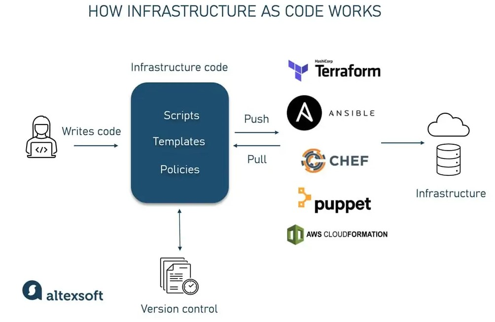

# Infrastructure as Code (IaC)

## What is IaC?

IaC, or Infrastructure as Code, is a methodology used to manage and provision IT infrastructure through machine-readable definition files, rather than physical hardware configuration or interactive configuration tools. This approach enables developers and system administrators to automatically manage, monitor, and provision resources, making it an essential practice in DevOps and cloud computing environments. By treating infrastructure as code, teams can apply the same version control, testing, and automation techniques used in software development to infrastructure management, leading to more consistent, efficient, and reliable systems.

## Why should you use IaC?

There are several key benefits to using IaC in your organization:

1. **Consistency**: IaC ensures that infrastructure is defined and provisioned in a consistent and repeatable manner, reducing the risk of configuration drift and human error.

2. **Efficiency**: By automating the provisioning and management of infrastructure, IaC enables teams to deploy resources more quickly and efficiently, reducing the time and effort required to maintain systems.

3. **Scalability**: IaC allows teams to easily scale infrastructure up or down based on demand, making it easier to respond to changing requirements and workload.

4. **Collaboration**: Infrastructure code can be version-controlled and shared among team members, enabling collaboration and knowledge sharing across the organization.

5. **Testing**: IaC enables teams to test infrastructure changes in a controlled environment before deploying them to production, reducing the risk of outages and downtime.

Overall, IaC helps organizations improve agility, reduce costs, and increase the reliability of their infrastructure, making it an essential practice for modern IT operations.

## When should you use IaC?

IaC is particularly well-suited for organizations that:

- Manage complex or rapidly changing infrastructure environments
- Use cloud computing services or virtualized environments
- Embrace DevOps practices and automation
- Require consistent and repeatable infrastructure deployments
- Want to improve collaboration and knowledge sharing among team members

If your organization falls into one or more of these categories, IaC can help you streamline your infrastructure management processes and improve the efficiency and reliability of your systems.

## Where can you use IaC?

IaC can be used to manage a wide range of infrastructure resources, including:

- Virtual machines
- Containers
- Networks
- Storage
- Load balancers
- Databases
- Monitoring and logging services

Popular IaC tools like Terraform, Ansible, and AWS CloudFormation support a wide range of cloud providers and infrastructure services, making it easy to manage and provision resources across different environments.

## What tools are available for IaC?

There are several popular tools available for implementing IaC, including:

1. **Terraform**: A widely-used open-source tool for building, changing, and versioning infrastructure safely and efficiently.

2. **Ansible**: An open-source automation tool that can be used for configuration management, application deployment, and infrastructure orchestration.

3. **AWS CloudFormation**: A service provided by Amazon Web Services for defining and provisioning AWS infrastructure using JSON or YAML templates.

4. **Google Cloud Deployment Manager**: A service provided by Google Cloud Platform for managing Google Cloud resources using configuration files.

5. **Azure Resource Manager**: A service provided by Microsoft Azure for managing Azure resources using JSON or YAML templates.

These tools provide a range of features and capabilities for managing infrastructure as code, enabling teams to automate and streamline their infrastructure management processes.

## What are the benefits of Ansible?

Ansible is a popular open-source automation tool that offers several key benefits for managing infrastructure as code:

1. **Agentless**: Ansible uses SSH to connect to remote servers, eliminating the need for agents or additional software to be installed on target systems.

2. **Simple**: Ansible uses YAML syntax for defining playbooks, making it easy to read and write automation scripts.

3. **Extensible**: Ansible can be extended with custom modules and plugins to support a wide range of use cases and integrations.

4. **Idempotent**: Ansible playbooks are idempotent, meaning they can be run multiple times without changing the system state if no changes are required.

5. **Community**: Ansible has a large and active community of users and contributors, providing access to a wealth of resources, modules, and playbooks.

Overall, Ansible is a powerful and flexible tool for automating infrastructure management tasks, making it a popular choice for organizations looking to implement IaC practices.

## Who is using Ansible?

Ansible is used by a wide range of organizations and teams, from small startups to large enterprises, across various industries. Some common use cases for Ansible include:

- Configuration management
- Application deployment
- Infrastructure orchestration
- Continuous integration and continuous deployment (CI/CD)
- Security automation
- Network automation

Organizations like NASA, Twitter, and Red Hat have adopted Ansible to automate and streamline their infrastructure management processes, demonstrating the broad applicability and scalability of the tool.
